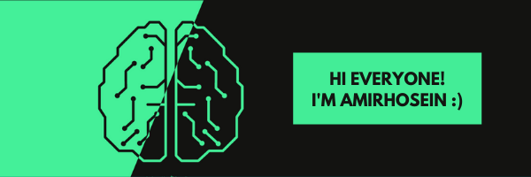

---

  <a href="https://www.instagram.com/amir.dallalan">Instagram</a> •
  <a href="https://www.linkedin.com/in/amirhdallalan/">Linkedin</a> •
  <a href="https://twitter.com/intent/follow?screen_name=amirdallalan&tw_p=followbutton">Twitter</a> •
  <a href="https://drive.google.com/file/d/1t_8wv0Or4PJJ5wiZ1bwG_2a_DAhM9_qC/view?usp=sharing">Resume</a>

---
## About me
I'm a Machine Learning Developer. I'm currently working on my skillset and learning new things. you can see more [here]("zil.ink/amirdallalan").

## Skills

<ul>
    <li>💻 Machine Learning</li>
    <li>🧠 Deep Learning</li>
    <li>📊 Data Analysis</li>
    <li>🖼 Image Processing</li>
    <li>⚡ Signal Processing</li>
</ul>

## Languages
<ul>
    <li>🐍 Python</li>
    <li>🖥 C++</li>
    <li>🟰 Matlab</li>
    <li>📃 R</li>

</ul>

## Interests
<ul>
    <li>Big Data</li>
    <li>Data Mining</li>
    <li>Artificial Intelligence</li>
    <li>Bioinformatic</li>
    <li>Medical Data Analysis</li>
    <li>Computer Vision</li>
    <li>Robotics</li>
    <li>Microcontroller</li>
</ul>